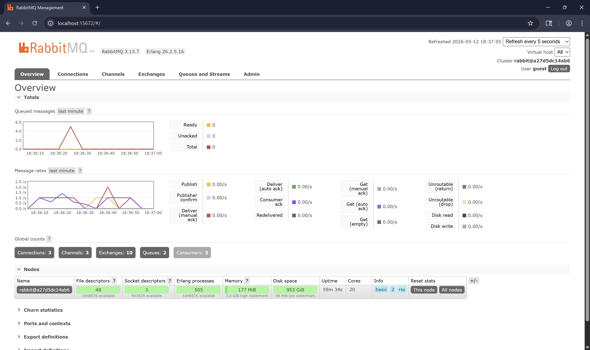
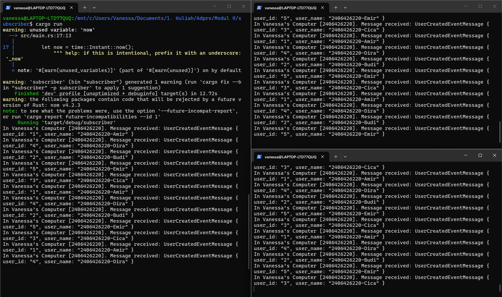

# Reflection

> What is amqp?

AMQP (Advanced Message Queuing Protocol) adalah protokol standar terbuka pada lapisan aplikasi (application layer) yang dirancang khusus untuk message-oriented middleware. Protokol ini berfungsi layaknya sebuah sistem pos digital yang bertugas mengatur, merutekan, dan mengantarkan data antar berbagai perangkat lunak. Sederhananya, AMQP menyediakan seperangkat aturan baku yang memungkinkan berbagai aplikasi untuk saling berkomunikasi secara efisien melalui message broker, seperti RabbitMQ. Sistem ini menjamin bahwa setiap pesan yang dikirim tidak akan hilang, melainkan dapat diantrekan dan dikirimkan dengan tingkat keandalan yang sangat tinggi. Selain itu, AMQP juga mendukung arsitektur komunikasi yang asinkron, sehingga pengirim pesan bisa tetap bekerja tanpa harus menunggu penerima siap memproses datanya. Keunggulan utamanya adalah fleksibilitas yang menjembatani komunikasi dengan mulus, meskipun aplikasi yang berinteraksi dibuat menggunakan bahasa pemrograman yang sama sekali berbeda. Bahkan, protokol ini tetap bekerja secara optimal untuk menghubungkan sistem-sistem yang berjalan pada infrastruktur server atau lingkungan operasi yang terpisah secara fisik.

> What does it mean? guest:guest@localhost:5672, what is the first guest, and what is the second guest, and what is localhost:5672 is for?

Ini adalah URI (Uniform Resource Identifier) koneksi yang memberi tahu aplikasi Rust secara spesifik bagaimana dan di mana harus terhubung dengan message broker.
- guest yang pertama: Ini adalah username (nama pengguna). "guest" adalah nama pengguna bawaan (default) yang otomatis dibuat saat RabbitMQ pertama kali diinstal.
- guest yang kedua: Ini adalah password untuk pengguna tersebut. "guest" juga merupakan kata sandi bawaan untuk akun "guest".
- localhost:5672: Ini menentukan alamat host dan nomor port dari server tempat message broker tersebut beroperasi.
    - localhost: Menandakan bahwa message broker (misalnya RabbitMQ) berjalan di komputer lokal yang sama persis dengan tempat aplikasi Rust yang dijalankan.

    - 5672: Ini adalah nomor port jaringan standar bawaan yang digunakan oleh server AMQP untuk menerima koneksi masuk (koneksi standar/TCP tanpa enkripsi).

## Simulation Slow Subscriber

Pada simulasi saya, jumlah pesan maksimum yang menumpuk di dalam queue adalah 10 pesan. Meskipun saya menjalankan program publisher sebanyak 7 kali secara berturut-turut (total 35 pesan), antrean tidak menumpuk hingga angka maksimal tersebut karena subscriber tetap aktif memproses pesan di latar belakang.

Angka 10 ini mencerminkan selisih kecepatan antara pengiriman pesan yang instan oleh publisher dan pemrosesan pesan oleh subscriber yang memiliki jeda waktu (thread::sleep). RabbitMQ menyimpan pesan-pesan yang belum sempat diproses ke dalam antrean agar tidak hilang. Begitu aktivitas pengiriman dari publisher berhenti, subscriber segera menghabiskan sisa antrean hingga kembali ke angka 0, yang ditandai dengan penurunan tajam pada grafik Queued Messages di akhir.

## Running at Least Three Subscribers

Pada tahap pengujian ini, saya melakukan simulasi penanganan slow subscriber dengan menjalankan tiga instansi subscriber secara bersamaan untuk memproses pesan dari antrean yang sama, di mana efektivitas distribusi beban ini terlihat jelas pada log terminal ketiga subscriber yang berjalan secara paralel. Berdasarkan hasil observasi pada grafik, penggunaan multi-konsumer ini terbukti sangat efektif dalam meningkatkan throughput sistem karena RabbitMQ mendistribusikan beban secara merata kepada seluruh subscriber, sehingga setiap konsol menampilkan pemrosesan pesan yang berbeda secara bergantian seperti "Amir", "Budi", hingga "Emir" tanpa adanya duplikasi tugas. Lonjakan pada grafik Queued Messages hanya menyentuh angka 5 karena kapasitas pemrosesan meningkat secara paralel, dengan jeda waktu satu detik per pesan pada masing-masing kode subscriber, sistem kini mampu menyelesaikan tiga pesan sekaligus dalam satu detik sehingga antrean dikosongkan dengan jauh lebih cepat. Sinkronisasi antara log terminal yang sibuk dan grafik yang stabil membuktikan bahwa arsitektur ini berhasil menangani lonjakan data secara efisien melalui skalabilitas horizontal, namun sistem ini masih dapat ditingkatkan ke depannya dengan menambahkan mekanisme graceful shutdown untuk mencegah hilangnya pesan saat aplikasi dihentikan mendadak serta pengaturan Quality of Service (QoS) melalui prefetch_count untuk memastikan distribusi beban yang lebih adil antar konsumer.